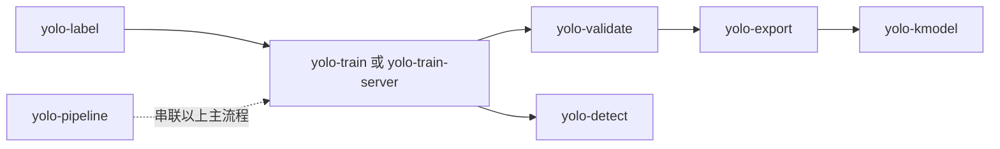

# YOLOv5 / K230 工程布局

这份文件是当前工程的“地图”。数据集和训练输出仍保留原路径，避免破坏已有脚本、缓存和实验记录。

## 1. 数据集

`ball_image/` 是原始图片、合成数据集和可视化中间产物的本地数据区，不是单一数据集。现在按来源、数据集和中间产物分层。

| 路径 | 类型 | 规模 | 用途 | 对应实验 |
|---|---|---:|---|---|
| `ball_image/source/canmv-frame-2026-09-05T10-59-25-573Z.png` | 原始轨道图 | 1 | 合成数据的输入 | 所有 ball 数据集 |
| `ball_image/datasets/yolo_dataset_10000/` | 正式基线集 | 10000 张，8000/1000/1000 | 自动检测半径约 15，增强训练 | `ball_320` |
| `ball_image/datasets/yolo_dataset_10000_ref18/` | 参数对照集 | 10000 张，8000/1000/1000 | 手动半径 18，不是基线集的同名副本 | `ball_320_ref18` |
| `ball_image/datasets/yolo_dataset_benchmark/` | 快速评测集 | 250 张，200/25/25 | 快速比较模型 | 不用于正式训练 |
| `ball_image/datasets/yolo_dataset_smoke/` | 冒烟集 | 12 张，10/1/1 | 检查命令、路径和数据格式 | 不用于正式训练 |

下面这些不是训练集，而是 `scripts/dataset/ball_recompose.py` 按需生成的预览/调试结果；本次清理已删除现有生成物：

```text
ball_image/artifacts/output/
ball_image/artifacts/output_manual/
ball_image/artifacts/output_manual_final/
ball_image/artifacts/output_multi/
ball_image/artifacts/output_refined/
ball_image/artifacts/output_sequence/
```

使用建议：主线训练明确写 `ball_image/datasets/yolo_dataset_10000/data.yaml`；做半径 18 的对照实验时明确写 `ball_image/datasets/yolo_dataset_10000_ref18/data.yaml`，不要只写一个模糊的 `data.yaml`。

## 2. 模型和 ONNX

模型按“实验目录”归档，不在工程根目录放模型：

```text
yolov5-7.0/
└── runs/train/<experiment>/
    ├── weights/
    │   ├── best.pt          # 训练 checkpoint
    │   ├── last.pt          # 最后一个 checkpoint
    │   ├── best.onnx        # 与 best.pt 对应的 ONNX
    │   └── best.kmodel      # 与该实验对应的 K230 产物
    ├── k230_verify/
    │   └── cpu_reference/   # PC 端 reference，不是板端 kmodel
    └── k230_deployment/     # 发送到板端的部署副本和配置
```

当前已存在的实验：

- `runs/train/ball_320/`：对应 `yolo_dataset_10000`。
- `runs/train/ball_320_ref18/`：对应 `yolo_dataset_10000_ref18`。
- `runs/train/ball_320_smoke/`：只保留训练 checkpoint，用于冒烟检查。

`K230_Yolov5n/mp_deployment_source/` 下的 kmodel 是旧参考/部署样例，不应覆盖当前实验目录里的输出。

## 3. 根目录保留范围

| 路径 | 保留原因 |
|---|---|
| `yolov5-7.0/` | YOLOv5 核心代码、预训练权重和 `runs/` 训练/验证结果 |
| `ball_image/` | 原始图片和正式训练数据集 |
| `K230_Yolov5n/` | ONNX→kmodel 转换工具、部署源码、nncase wheel 和参考样例 |
| `X-AnyLabeling/` | 标注和自动标注工具，供 `yolo-label` 使用 |
| `.conda/` | 当前训练/导出环境，已验证包含 Python 3.10、PyTorch 和 nncase 依赖 |
| `.codex/`、`.claude/` | 项目 skills、参考资料和代理模板 |
| `server/`、`scripts/`、`docs/` | 远程训练、数据生成、自动转换和项目文档 |

`scripts/` 按执行对象分组，不和 skills 混放：

```text
scripts/
├── yolo/                  # 本机环境、训练、验证、推理、导出
│   ├── setup.ps1
│   ├── train.ps1
│   ├── validate.ps1
│   ├── detect.ps1
│   └── export.ps1
├── dataset/               # 数据集生成和重组
└── k230/                  # ONNX→kmodel、部署配置和完整转换流水线
    ├── convert.ps1
    ├── finish_training_and_convert.ps1
    └── generate_k230_config.py
```

已清理的内容都是可重建或重复的：`__pycache__`、X-AnyLabeling `build` 缓存、`ball_image/artifacts` 预览结果、dotnet 安装包和重复的根目录 kmodel。

## 4. Skills 是什么

Codex 使用 `.codex/skills/`；Claude 使用 `.claude/skills/`。两边是同一组能力的不同适配副本，不是 16 个独立流程。维护关系见 `.codex/sync-manifest.json`。

| Skill | 作用 | 什么时候用 |
|---|---|---|
| `yolo-label` | X-AnyLabeling 标注、自动标注、导出 YOLO 数据集 | 还没有标签，或要修标签 |
| `yolo-train` | 本机 YOLOv5 训练、续训、调参 | 在本机训练 |
| `yolo-train-server` | SSH/rsync 到远程 GPU 训练并拉回结果 | 本机不训练，使用服务器 |
| `yolo-validate` | 在验证集上算 mAP、Precision、Recall 等 | 比较模型好坏 |
| `yolo-detect` | 对图片、视频、摄像头做推理 | 看实际检测效果 |
| `yolo-export` | `.pt` 导出 ONNX、TensorRT、TorchScript 等 | 需要部署格式 |
| `yolo-kmodel` | ONNX 转 K230 kmodel、量化和 PC reference 检查 | 要部署到 K230 |
| `yolo-pipeline` | 把训练→验证→导出→kmodel 串成一条流程 | 想跑完整流水线；它是总控，不必再手动重复每一步 |

最短选择路径：



## 5. 当前整理规则

1. 一个训练实验只使用一个 `runs/train/<experiment>/` 目录，实验名要体现数据集变体。
2. 正式 ONNX 只放在对应实验的 `weights/`，CPU reference 的 ONNX 只放在 `k230_verify/cpu_reference/`。
3. 生成的 kmodel 先留在实验目录；`mp_deployment_source/` 只作为参考/板端部署样例。
4. `benchmark` 和 `smoke` 数据集只用于快速检查，不能误当正式训练集。
5. `ball_image/` 和 `yolov5-7.0/runs/` 已被 `.gitignore` 忽略，属于本机数据和实验产物；迁移目录时必须同步修改脚本和文档中的绝对/相对路径。
